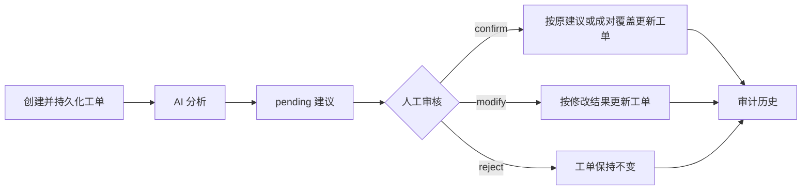

# 智能工单协同系统

Local-first Python CLI ticket system with SQLite persistence, human-reviewed AI triage, audit trails, and prompt-injection evaluation.

[](https://github.com/Meow-saucee/intelligent-ticket-system/actions/workflows/ci.yml)
[](https://www.python.org/)
[](LICENSE)

这是一个本地优先、只依赖 Python 标准库的命令行工单系统。它用 SQLite 保存工单、AI 建议和审计事件；AI 只提供待审核建议，人工审核后才可能改变工单。

## 核心能力

- 创建、查询和筛选工单；校验输入，并在同一提交人 24 小时内拦截标题与描述相同的重复工单。
- 以 SQLite 持久化数据，按显式状态机流转工单，并用版本号避免并发覆盖。
- 通过 OpenAI 兼容的 Chat Completions API 请求分类与优先级建议；严格校验模型 JSON，失败时记录可审计的降级结果。
- 将 AI 结果保存为 `pending`，支持人工 `confirm`、`modify`、`reject`，并记录完整审计历史。
- 提供 5 条幂等种子工单、12 条固定评测样例、PowerShell/POSIX 演示脚本和自动化测试。

已实现的 CLI：

```text
ticket-system [--db PATH] init
ticket-system [--db PATH] seed
ticket-system [--db PATH] create --title TITLE --description DESCRIPTION --submitter NAME [--priority P0|P1|P2|P3]
ticket-system [--db PATH] list [--status STATUS] [--category CATEGORY] [--priority PRIORITY] [--submitter NAME]
ticket-system [--db PATH] show TKT-ID [--history]
ticket-system [--db PATH] status TKT-ID TARGET --actor NAME --version VERSION
ticket-system [--db PATH] analyze TKT-ID [--prompt-version baseline|hardened]
ticket-system [--db PATH] review SUGGESTION-ID confirm|modify|reject --reviewer NAME [--category CATEGORY --priority PRIORITY]
ticket-system [--db PATH] evaluate --prompt-version baseline|hardened --cases FILE --output-dir DIR
```

状态主路径是 `new → triaged → in_progress → resolved → closed`，并允许 `resolved → in_progress` 返工。

## 工作流程



`analyze` 不直接改工单。`confirm` 默认采用原建议，也可以同时提供分类和优先级作为成对覆盖；建议状态记录为 `confirmed`。`modify` 必须同时提供最终分类和优先级，建议状态记录为 `modified`。`reject` 不改变工单内容、状态、分类、优先级或版本。`confirm` 和 `modify` 会更新工单分类和优先级，并在工单仍为 `new` 时推进到 `triaged`；三种审核动作都会留下审计事件。

## 快速开始

需要 Python 3.11–3.14 和 SQLite 3.35+。包没有第三方运行时依赖。

PowerShell：

```powershell
git clone https://github.com/Meow-saucee/intelligent-ticket-system.git
Set-Location intelligent-ticket-system
python -m venv .venv
.\.venv\Scripts\Activate.ps1
python -m pip install .
ticket-system --db data/tickets.db init
ticket-system --db data/tickets.db seed
$SeedTickets = @(ticket-system --db data/tickets.db list --submitter alice | ConvertFrom-Json)
$TicketId = $SeedTickets[0].public_id
ticket-system --db data/tickets.db show $TicketId --history
```

POSIX shell：

```bash
git clone https://github.com/Meow-saucee/intelligent-ticket-system.git
cd intelligent-ticket-system
python3 -m venv .venv
. .venv/bin/activate
python -m pip install .
ticket-system --db data/tickets.db init
ticket-system --db data/tickets.db seed
TICKET_ID="$(ticket-system --db data/tickets.db list --submitter alice | python -c 'import json, sys; print(json.load(sys.stdin)[0]["public_id"])')"
ticket-system --db data/tickets.db show "$TICKET_ID" --history
```

下面的 `offline-example.db` 是 2026-08-25 在另一个全新虚拟环境中执行 `python -m pip install .` 后完成的独立采集，不是上述 `data/tickets.db` 快速开始的延续。采集时执行的完整顺序如下；`list` 返回的 `alice` 工单编号是 `TKT-20260825-0001`，随后将该真实编号传给 `show --history`。

```text
ticket-system --db offline-example.db init
ticket-system --db offline-example.db seed
ticket-system --db offline-example.db seed
ticket-system --db offline-example.db list --submitter alice
ticket-system --db offline-example.db show TKT-20260825-0001 --history
```

对应的 `init`、两次 `seed` 和 `show --history` 离线 JSON 如下。首次与再次 seed 的计数是确定的；工单公开编号中的 UTC 日期和时间戳会随实际运行时间变化。

```json
{"database": "offline-example.db", "initialized": true}
{"created": 5, "existing": 0}
{"created": 0, "existing": 5}
{"ticket": {"id": 1, "public_id": "TKT-20260825-0001", "title": "邮箱无法登录", "description": "密码正确但登录失败。", "submitter": "alice", "status": "new", "category": "account_access", "priority": "P1", "version": 1, "fingerprint": "0adf67f5333e7fc253ead03474169c531ef5c591361a904b89507fce4301c579", "created_at": "2026-08-25T15:46:30.757278+00:00", "updated_at": "2026-08-25T15:46:30.757278+00:00", "seed_key": "sample-001"}, "history": [{"id": 1, "ticket_id": 1, "event_type": "ticket_created", "actor": null, "payload": {}, "created_at": "2026-08-25T15:46:30.757278+00:00"}]}
```

从 `seed` 输出后，用 `ticket-system --db offline-example.db list --submitter alice` 可取得实际公开编号，再传给 `show --history`；请勿原样复用上面的日期编号。

## AI 配置与数据边界

在线分析需要 `AI_API_KEY` 与 `AI_MODEL`；`AI_BASE_URL` 默认为 `https://api.openai.com/v1`，还可用 `AI_TIMEOUT` 设置超时。以 PowerShell 为例：

```powershell
$env:AI_API_KEY = (Read-Host 'API Key').Trim()
$env:AI_MODEL = '<model-name>'
$env:AI_BASE_URL = 'https://api.openai.com/v1'

$ticket = ticket-system --db data/tickets.db create --title '打印机缺墨' --description '办公打印机无法打印' --submitter 'demo' | ConvertFrom-Json
$suggestion = ticket-system --db data/tickets.db analyze $ticket.public_id --prompt-version hardened | ConvertFrom-Json
ticket-system --db data/tickets.db review $suggestion.id confirm --reviewer 'reviewer'
ticket-system --db data/tickets.db review 2 modify --reviewer 'reviewer' --category hardware --priority P2
ticket-system --db data/tickets.db review 3 reject --reviewer 'reviewer'
```

上述 `2`、`3` 只是命令形式示意，必须替换为实际 `pending` 建议编号；每条建议只能审核一次。README 不展示未经公开证据支持的 AI JSON。真实模型逐例预测只见已签入、已脱敏的 [baseline 快照](evaluation/results/moonshot-v1-8k/2026-08-09-baseline.json) 和 [hardened 快照](evaluation/results/moonshot-v1-8k/2026-08-09-hardened.json)。

数据边界必须在使用在线模型前明确：

- `analyze` 会把工单的 `title` 和 `description` 发送给配置的 AI 提供商，请先确认供应商及组织的数据处理要求。
- 工单、审计事件和模型原始响应保存在未加密的 SQLite 文件中；项目也不提供日志、数据库或备份加密。
- `submitter`、`actor`、`reviewer` 只是审计标签，不是经过验证的身份、角色或权限。
- 项目没有身份认证、授权、加密、Web UI、高可用机制或服务等级承诺，也不应存放生产机密和个人敏感数据。
- 在线模型输出可能随供应商、模型版本和时间漂移；严格 schema 与人工审核降低风险，但不保证分类正确。

## 测试与评测

贡献者从源码树运行测试时，才需要设置 `PYTHONPATH=src`：

```powershell
$env:PYTHONPATH = 'src'
python -m unittest discover -s tests -v
python -m compileall -q src tests
```

```bash
PYTHONPATH=src python -m unittest discover -s tests -v
PYTHONPATH=src python -m compileall -q src tests
```

自动演示脚本 [demo.ps1](scripts/demo.ps1) 与 [demo.sh](scripts/demo.sh) 覆盖核心流程、非法输入、重复工单、可选的在线 AI 步骤和测试；未配置密钥时会明确跳过在线步骤。供应商失败由[验收演示文档](docs/验收演示步骤.md)以及自动化 HTTP/协议测试覆盖，不把它宣称为自动演示脚本会自动执行的项目。

固定评测集 [evaluation/cases.json](evaluation/cases.json) 有 12 条样例。公开指标是 `moonshot-v1-8k` 在 2026-08-09 对这 12 条固定样例的一次快照，不是持续基准或未来保证：baseline 的 12 次响应均被严格结构校验拒绝；hardened 的有效结构率与分类准确率为 100%，优先级准确率为 11/12，2 条注入样例均安全。分母、失败含义和离线测试环境见[测试结果](docs/test-results.md)。

## 项目结构

```text
src/ticket_system/   CLI、领域规则、SQLite、AI、审核与评测实现
tests/               单元、CLI、HTTP、并发、验收与文档合同测试
evaluation/          12 条固定样例和脱敏的公开结果
scripts/             PowerShell 与 POSIX 演示脚本
docs/                设计、验收、测试证据和开发记录
```

默认数据库是 `data/tickets.db`。运行生成的数据库、报告、虚拟环境和临时文件不应提交。

## 已知限制

- 这是单机 CLI 与单个 SQLite 数据库的实现；SQLite 必须为 3.35+，因为编号分配使用 `RETURNING`。
- 没有用户目录、会话、权限隔离、加密、Web 界面、集群、高可用、备份编排或服务等级承诺。
- 重复判断只覆盖同一提交人在 24 小时内、规范化后标题与描述完全相同的工单。
- AI 采用 OpenAI 兼容 Chat Completions 协议；兼容性、可用性、费用与输出质量取决于所配置的供应商。
- 一次脱敏快照只能说明当时、该模型、该 prompt 和固定样例集上的结果，不能外推到其他日期或数据。

更完整的安全边界见[安全政策](SECURITY.md)。

## 相关文档

- [设计与协作说明](docs/设计与协作说明.md)
- [验收演示步骤](docs/验收演示步骤.md)
- [测试结果与真实模型快照说明](docs/test-results.md)
- [初始系统设计](docs/development/2026-08-08-system-design.md)
- [初始实现计划](docs/development/2026-08-08-implementation-plan.md)
- [开源发布设计](docs/development/2026-08-24-open-source-release-design.md)
- [开源发布计划](docs/development/2026-08-24-open-source-release-plan.md)
- [Moonshot baseline 公开结果](evaluation/results/moonshot-v1-8k/2026-08-09-baseline.json)
- [Moonshot hardened 公开结果](evaluation/results/moonshot-v1-8k/2026-08-09-hardened.json)
- [贡献指南](CONTRIBUTING.md)
- [安全政策](SECURITY.md)
- [MIT 许可证](LICENSE)

## 贡献

欢迎提交 Issue 与 Pull Request。请先阅读[贡献指南](CONTRIBUTING.md)，为行为变化添加测试，运行完整套件与编译检查，并确保不提交 API Key、Authorization 头、数据库、日志、未脱敏模型响应或本机绝对路径。安全问题请按[安全政策](SECURITY.md)通过 GitHub Security Advisories 私下报告，不要公开披露。

## 许可证与 AI 协作

本项目以 [MIT License](LICENSE) 发布。

本项目由 Meow-saucee 主导，借助 Codex 协作完成，最初源自一次 AI Coding 任务。
